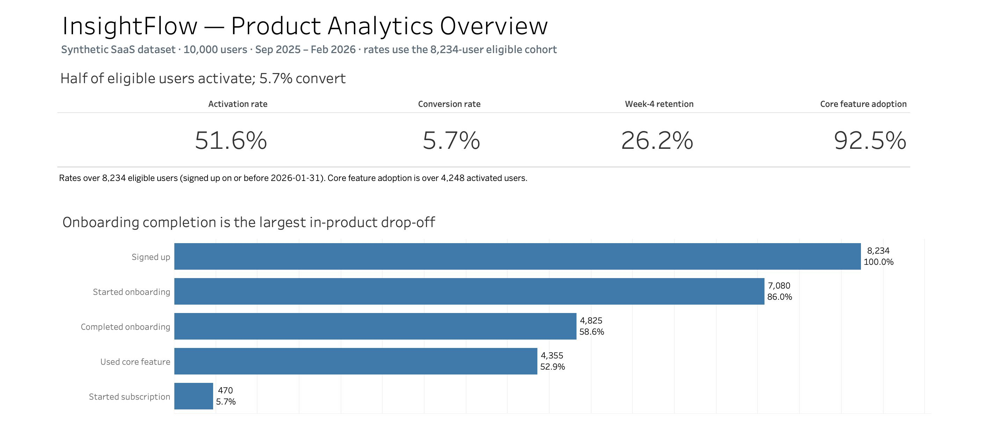
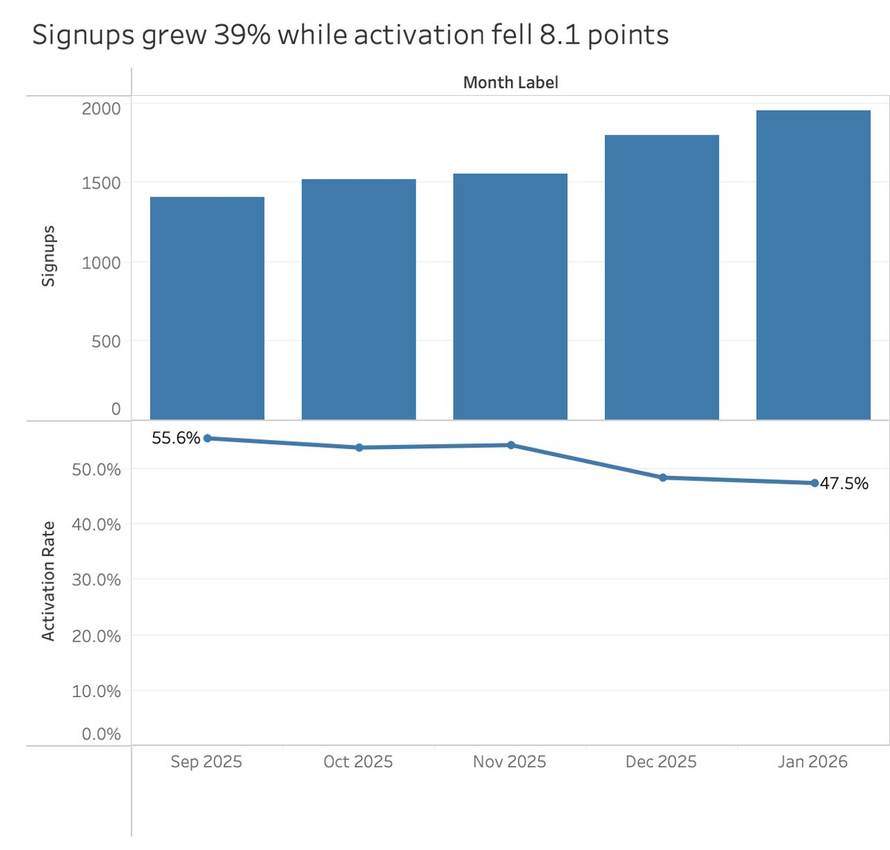
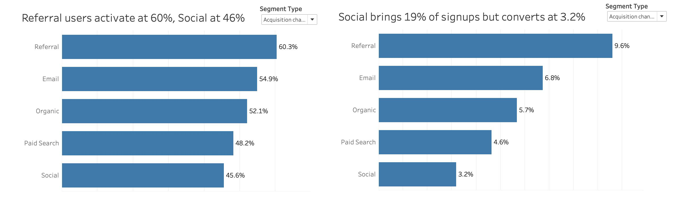
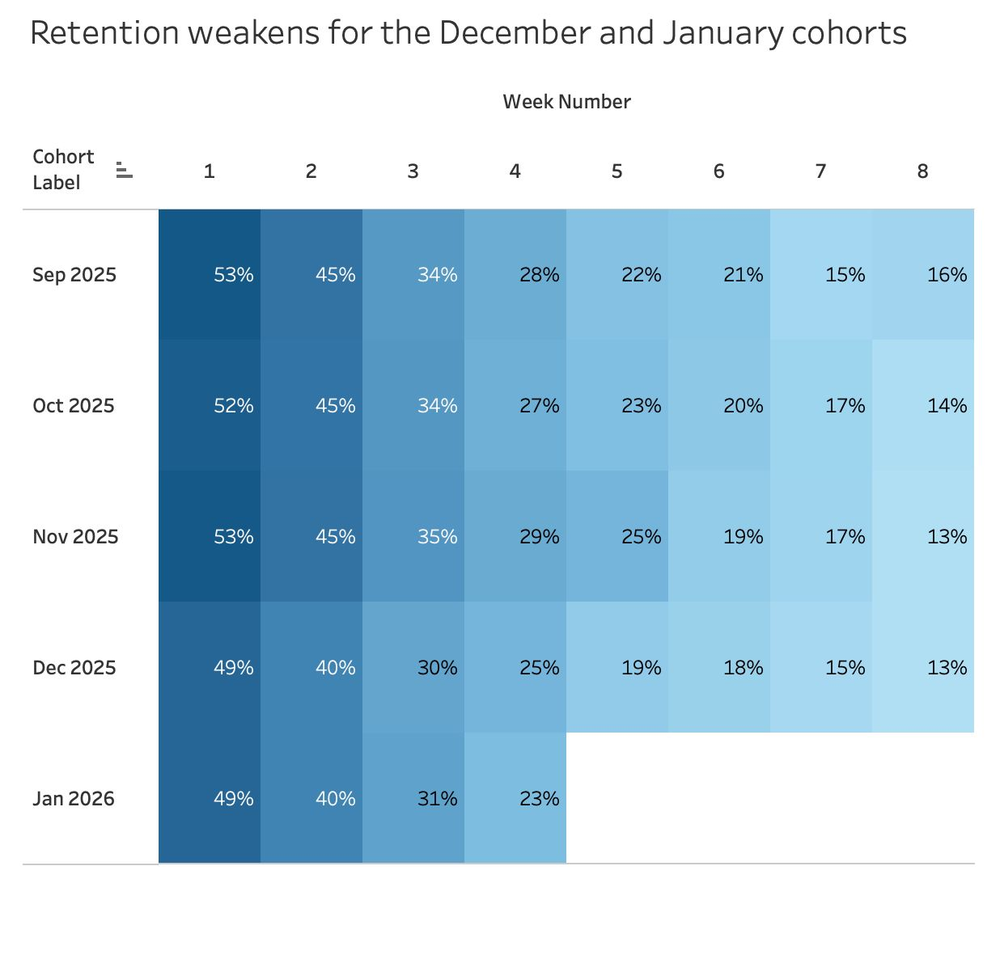
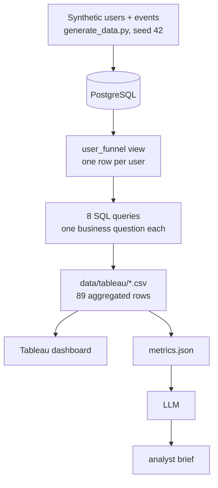

# InsightFlow

A small product analytics project for a fictional SaaS product: where
users drop out of the funnel, which segments behave differently, and
what a product team might look at next. PostgreSQL calculates the
metrics, Tableau presents them, and a language model turns the finished
numbers into a short stakeholder brief.

> **The dataset is synthetic**, generated with a fixed seed, and includes
> seeded behavioural patterns; some observations also emerged from the
> analysis. The project demonstrates method, not discovery. See
> [docs/DATA.md](docs/DATA.md).

## Dashboard

One dashboard, [`tableau/InsightFlow.twbx`](tableau/InsightFlow.twbx),
built in Tableau Public: a KPI band, the funnel, a cohort retention
heatmap, a monthly trend, and activation and conversion by segment. The
workbook embeds its data, so it opens without a database connection.









Chart titles state the finding rather than naming the sheet. The two
segment charts describe their default filter state — acquisition
channel — and a viewer who changes the dropdown moves past the title.

## Headline metrics

Eligible cohort: **8,234 users** — everyone who signed up at least 28
days before the data ends, so every user had the same chance to
activate, convert and return.

| Metric | Definition | Value |
|---|---|---|
| Activation | Completed onboarding within 7 days of signup | 51.6% |
| Conversion | Started a subscription within 28 days | 5.7% |
| Week-4 retention | Active on days 22–28 after signup | 26.2% |
| Core feature adoption | Used the core feature within 28 days, among the 4,248 **activated** users | 92.5% |

The last row uses a different denominator from the other three.

## Key findings

**Growth and activation moved in opposite directions.** Signups rose 39%
from 1,410 in Sep 2025 to 1,953 in Jan 2026, while activation fell 8.1
points, 55.6% to 47.5%. A volume-only view would show five good months.

**Onboarding completion is the largest in-product drop-off.** Of the
7,080 users who start onboarding, 68.2% finish — 2,255 lost at one step,
against 90.3% passing the next. The subscription step loses more (3,885)
but is a pricing boundary rather than a product problem.

**Channel and device compound.** Desktop activates at 56.4% against
mobile at 43.8%; across the 15 channel × device combinations the spread
widens to 26.1 points, from Referral / Desktop at 66.5% to Social /
Mobile at 40.5%. Mobile is 34.5% of the cohort.

**One channel brings volume without conversions.** Social is 19.4% of
signups and converts at 3.2%, against Referral's 9.6% — 1,601 users and
51 subscriptions, against Referral's smaller 1,281 and 123.

**Early feature adoption is associated with conversion — and the first
version of this result was wrong.** Among activated users, the 33.3% who
reached the core feature within 7 days converted at 18.0% against 6.8%.

Adoption was first measured over 28 days, while week-4 retention covers
days 22–28 — overlapping windows, so a user could count as an adopter
*because of* the day-24 activity that also marked them retained. That
version reported a 34.7-point retention gap and looked like the headline
result. Narrowing adoption to the first 7 days, so the measures share no
days, collapsed it to 4.6 points; the conversion gap survived.

It remains an association: separating the windows removed the
definitional overlap, not selection. Full brief:
[`outputs/analyst_brief.md`](outputs/analyst_brief.md).

## How to run

Requires PostgreSQL and Python 3. The pipeline needs no third-party
packages — generation is standard library, loading and exporting use the
`psql` CLI.

```bash
createdb insightflow
python3 scripts/generate_data.py     # writes data/raw/*.csv
./scripts/load_data.sh               # rebuilds the schema, loads PostgreSQL
psql -d insightflow -f sql/00_validate.sql
./scripts/export_metrics.sh          # writes data/tableau/*.csv
```

Every step is deterministic — dropping the database and rebuilding
reproduces each CSV byte for byte. Then open the workbook in Tableau.

The brief is optional. It needs `pip install -r requirements.txt` and an
API key in `.env` (gitignored, never written by any script), then
`python3 scripts/generate_ai_brief.py` — or `--dry-run` to build the
model's input without calling it.

## Architecture



PostgreSQL is the source of truth. The CSVs are a serving layer of 89
rows in total, so Tableau never touches the 61,377-row event table.

## Data model and metrics

Two tables, normalised rather than a star schema — the dataset is small
and the value is in the metric logic.

**users** — `user_id`, `signup_date`, `country`, `plan`, `device`,
`company_size`, `acquisition_channel`
**events** — `event_id`, `user_id`, `event_timestamp`, `event_name`

10,000 users and 61,377 events over 2025-09-01 to 2026-02-28. `CHECK`
constraints reject invalid categories at load time; a foreign key makes
orphan events impossible. `plan` is the tier chosen at signup, not
current billing state, so it works as a segment without being circular.

Week-4 retention as a KPI is measured over the eligible cohort; the
heatmap is per signup cohort, each month against its own signups. A
qualifying event is anything except `subscription_cancelled`.

## SQL

Everything rests on one view, `sql/00_user_funnel_view.sql`, which
flattens the event stream into one row per user with a flag per
milestone. Every metric definition lives there, so redefining activation
changes one file rather than eight and the queries stay short.

Eight queries, one business question each: headline rates
(`01_kpi_summary`), funnel drop-off (`02_funnel`), cohort retention
(`03_retention`), activation and conversion by segment (`04`, `05`),
early adopters (`06_feature_adoption`), monthly trend
(`07_monthly_trends`), and the channel × device leaderboard
(`08_top_segments`).

CTEs throughout, conditional aggregation with `FILTER`, `LAG` for
step-to-step and month-over-month change, `RANK` for the leaderboard,
and `generate_series` with `CROSS JOIN` for the retention grid.

`sql/00_validate.sql` runs nine integrity checks — duplicate keys,
orphan references, nulls, timestamp ranges — all returning 0. It also
prints volume, event mix and segment distribution for information.

## AI analyst

SQL computes the metrics. Python prepares a grounded input, with every
gap and rounded percentage precomputed
([`outputs/metrics.json`](outputs/metrics.json)). The model writes the
prose into
[`outputs/analyst_brief.md`](outputs/analyst_brief.md) — it has no
database access and does no arithmetic. Saving the input beside the
output means any claim can be traced to the number behind it.

## Limitations

- **The data is synthetic**, with seeded behavioural patterns. See
  [docs/DATA.md](docs/DATA.md).
- **Association is not causation.** "X is associated with Y and is worth
  investigating" is supported here; "X causes Y" is not. Establishing
  that would need an experiment.
- **The funnel is milestone-reach, not a strict sequence.** 1.30% of
  eligible users reached the core feature before completing onboarding,
  because engagement events fire from week 1 while some users finish
  onboarding later.
- **Onboarding is instrumented as two events**, started and completed,
  so the analysis bounds the largest drop-off without locating it inside
  onboarding.

## Repository

`sql/` the view, validation checks and eight business queries ·
`scripts/` generator, loader, exporter, AI brief · `data/tableau/` the
aggregated CSVs · `tableau/` the workbook · `outputs/` the brief and the
model's input · [`docs/DATA.md`](docs/DATA.md) the synthetic-data notice
